# Evidencias de la practica

## 1. Repositorio GitHub

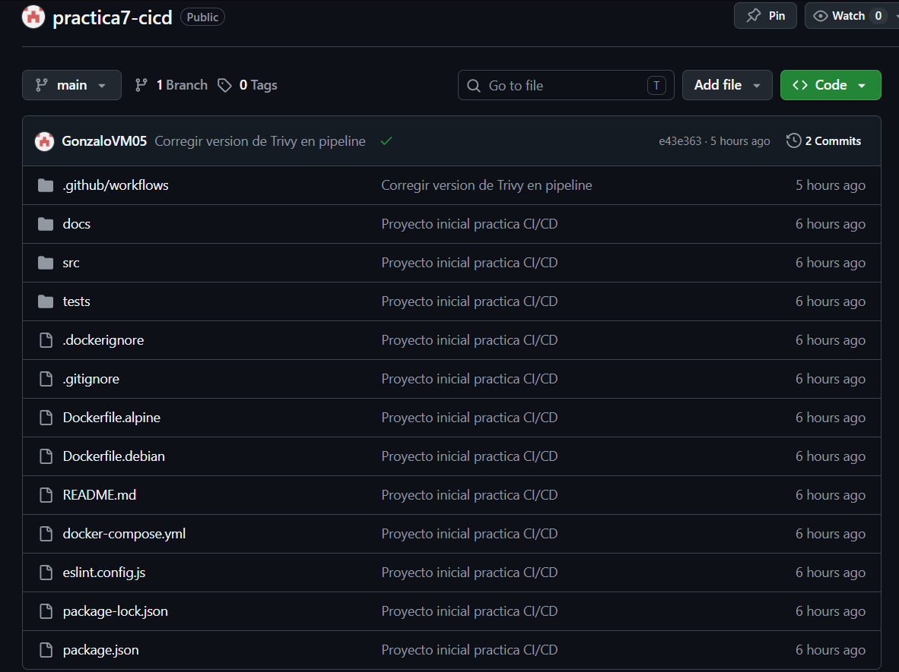

## 3. Ejecucion por push

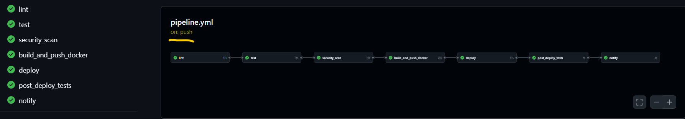

## 4. Ejecucion manual

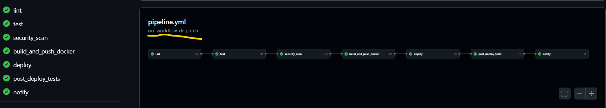

## 5. Ejecucion cron

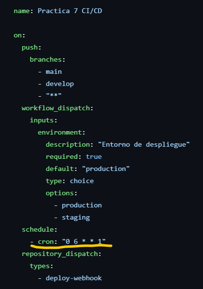

## 6. Webhook repository_dispatch

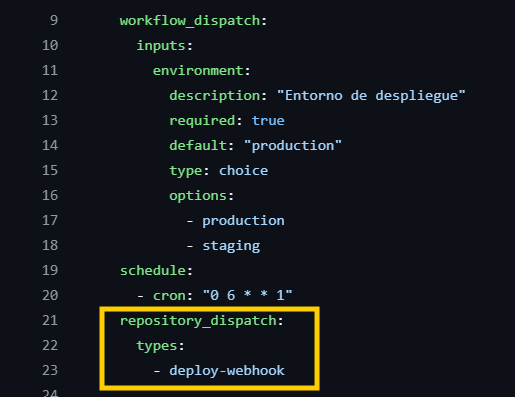

## 7. Triggers del pipeline

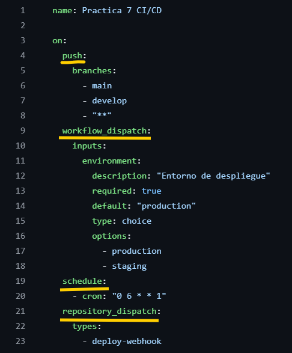

## 8. Jobs encadenados

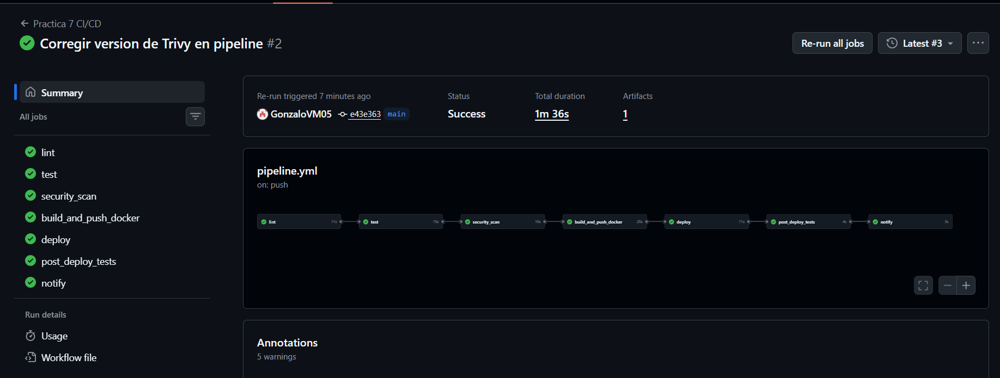

## 9. Lint

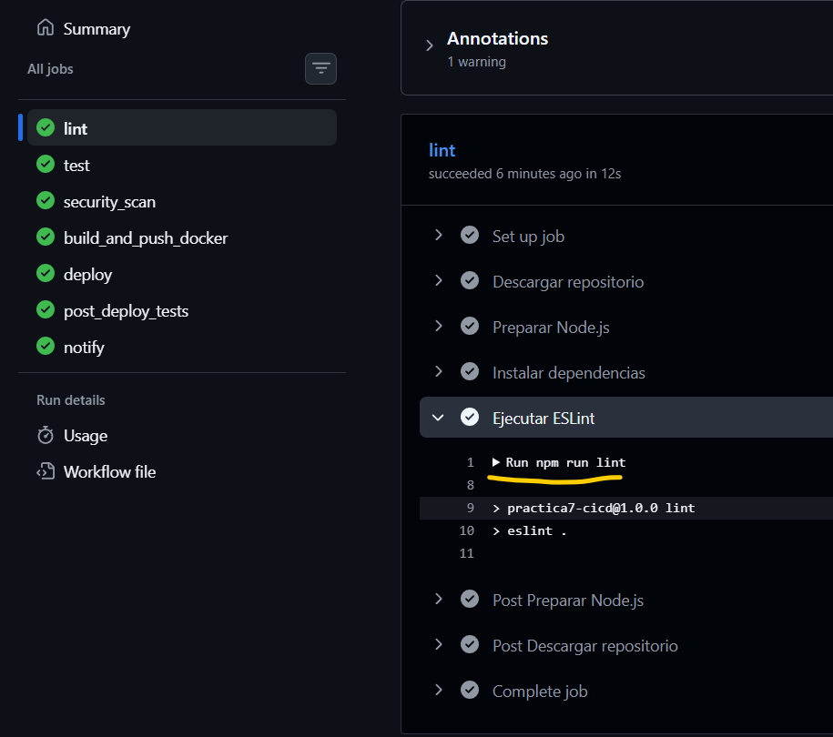

## 10. Tests y cobertura

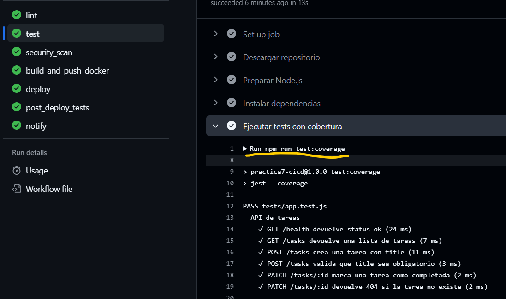

## 11. Security scan

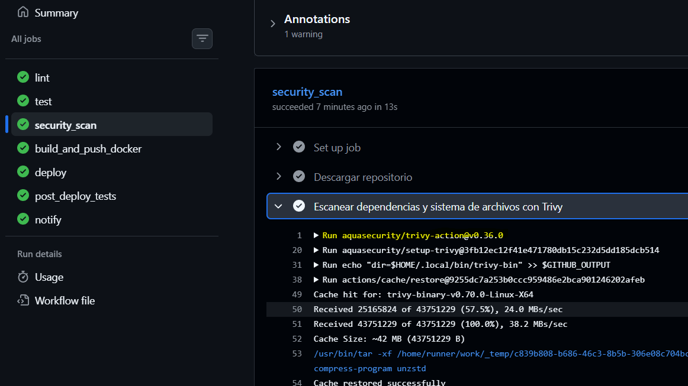

## 12. Build Docker

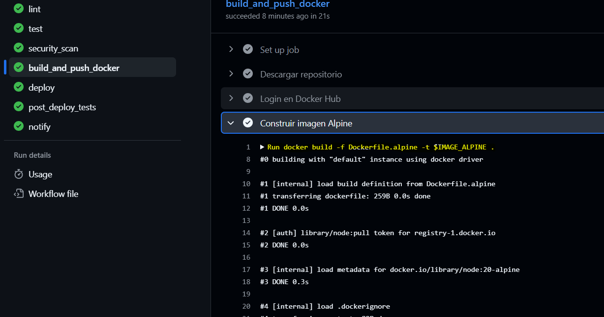
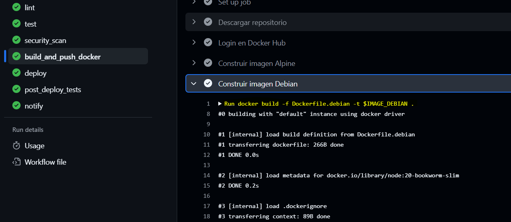

## 13. Push Docker Hub

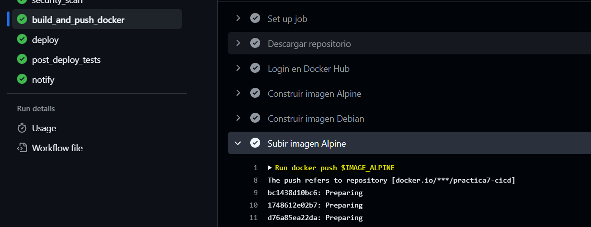
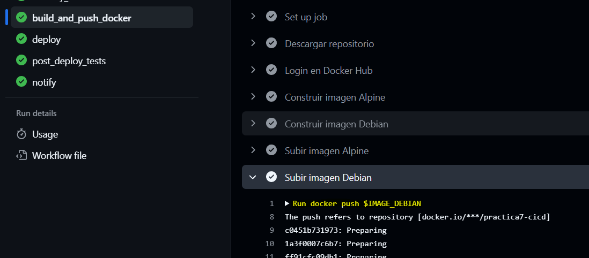

## 14. Despliegue por SSH

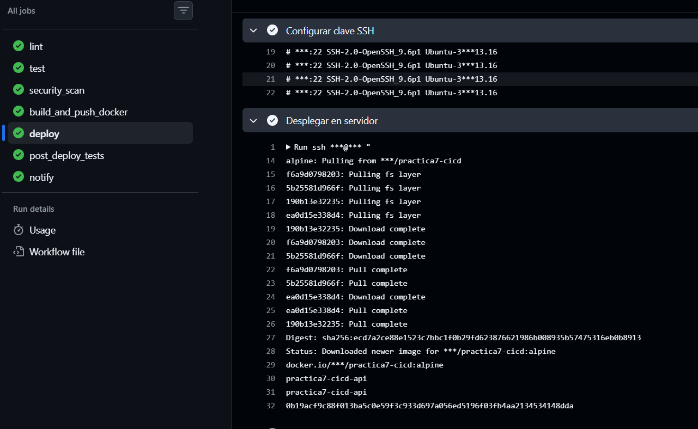

## 15. Prueba post-despliegue

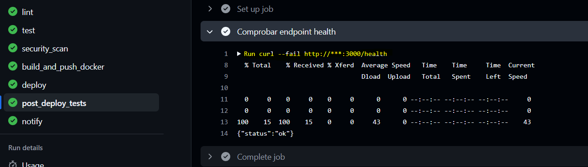

## 16. Notificacion email

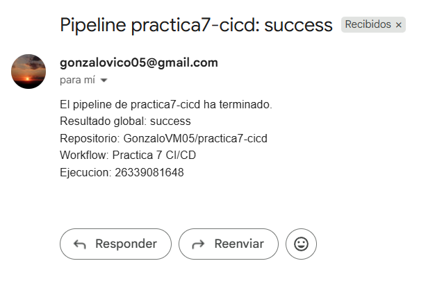

## 17. Servidor funcionando

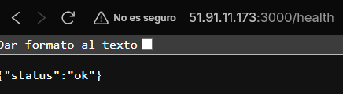

## 18. Docker en el VPS

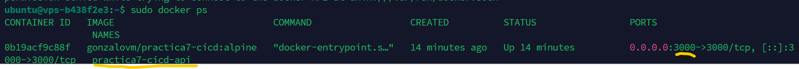

## 19. Secrets configurados

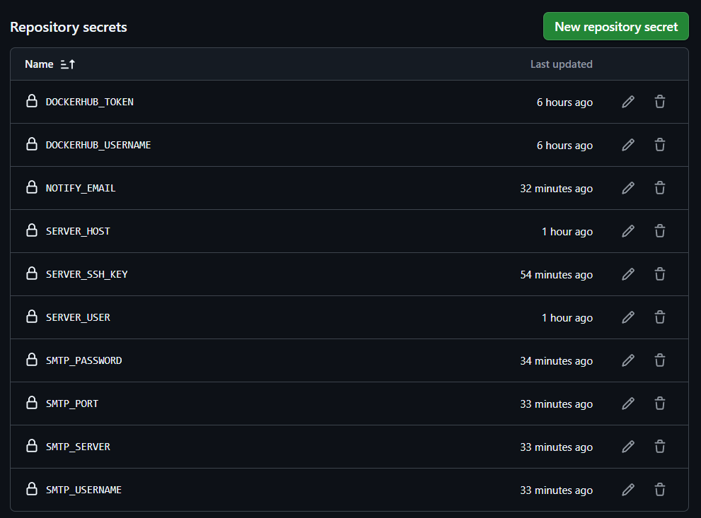
